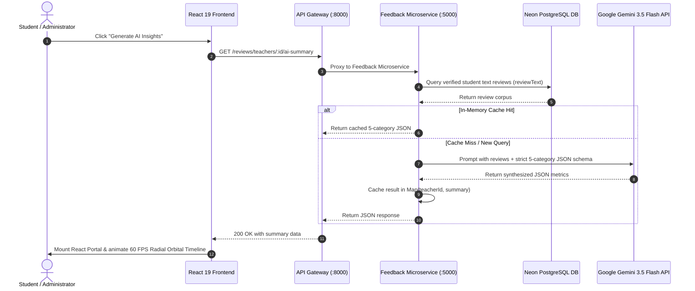

# AI Teacher Insights & Orbital Visualization

The Campus Feedback System integrates an automated LLM-powered review summarization pipeline powered by **Google Gemini 3.5 Flash** and an interactive, 60 FPS **Radial Orbital Timeline** visualization.

---

## 🪐 High-Level Synthesis Architecture

---

## 📊 The 5-Category Evaluation Taxonomy

To provide actionable and balanced feedback without information overload, the AI summarizer distills student consensus into 5 structured evaluation dimensions:

| Dimension | Key Name | Description | Theme Color |
| :--- | :--- | :--- | :--- |
| **Teaching Quality** | `teaching` | Lecture structure, pedagogical clarity, practical problem-solving. | `#ec4899` (Pink) |
| **Grading & Fairness** | `grading` | Evaluation rigor, rubric transparency, marking strictness. | `#06b6d4` (Cyan) |
| **Approachability** | `approachability` | Open-door accessibility, doubt resolution, student support. | `#f59e0b` (Amber) |
| **Course Workload** | `workload` | Assignment volume, lab rigor, weekly time commitment. | `#8b5cf6` (Purple) |
| **Overall Vibe** | `overall` | General student sentiment, course experience, overarching consensus. | `#10b981` (Emerald) |

---

## 🛡️ Resiliency & Fallback Strategy

1. **In-Memory Caching**: AI summaries are cached per teacher (`Map<string, Object>`) to eliminate redundant LLM API calls and optimize latency.
2. **Graceful Demo Fallback**: If the upstream Gemini API experiences temporary outages, rate limits (HTTP 429), or authentication hiccups, the backend automatically logs the event and falls back to a simulated response with realistic latency, ensuring demo stability.
3. **React Portal Isolation**: The orbital timeline modal is rendered directly into `document.body` via `createPortal`, isolating it from nested layout transforms, stacking contexts, and CSS overflow bounds.

---

## 🎨 Interactive Radial Orbital Timeline Features

- **Continuous 60 FPS Auto-Revolution**: Uses delta-timed `requestAnimationFrame` to rotate metric nodes smoothly around the central pulsating energy core.
- **Smart Reading Auto-Pause**: Automatically pauses rotation when a user hovers over a node or clicks to inspect a detailed metric card.
- **Interactive Orbit Controller**: Includes Play/Pause Orbit toggle and manual `+45°` step controls.
- **High-Contrast Dark Glassmorphism**: Cards feature deep opaque backgrounds (`#090d16`) with dynamic category-coded neon borders, preventing background bleed-through.
