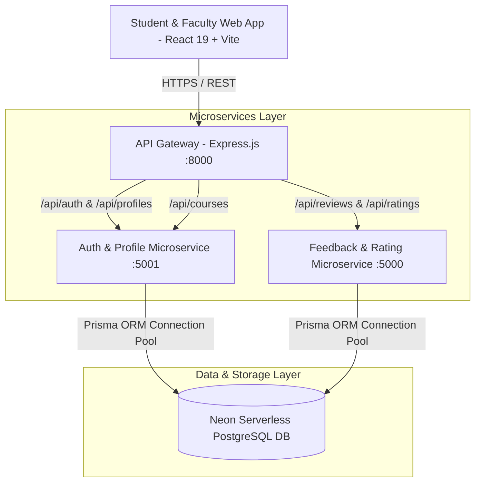

# System Architecture

The Campus Feedback System follows a microservices-based distributed architecture designed for scalability, fault isolation, and atomic data consistency.

---

## 🏛️ High-Level Architectural Topology

---

## 🧩 Architectural Components

### 1. API Gateway (`gateway`)
- **Port**: `8000`
- **Role**: Single entry point for all client requests.
- **Responsibilities**:
  - CORS negotiation and request header forwarding.
  - Reverse proxy routing using `http-proxy-middleware`.
  - Route normalization: Handles both `/api/*` and direct route prefixes seamlessly.
  - Centralized `/health` and status monitoring.

### 2. Authentication & Profile Service (`auth-service`)
- **Port**: `5001`
- **Responsibilities**:
  - Institutional `@thapar.edu` email verification via 6-digit cryptographic OTP.
  - Non-tamperable role determination (`STUDENT` vs `TEACHER`).
  - Student onboarding: Full Name, 10-digit roll number, engineering branch, batch group (`3Q11`–`3Q15`, `2Q11`–`2Q15`), year of study.
  - Faculty onboarding: Department, designation, course and batch offerings (`UCS120` to `3Q11`).
  - Course offering management with dynamic eligibility matching.

### 3. Feedback & Rating Microservice (`feedback-microservice`)
- **Port**: `5000`
- **Responsibilities**:
  - Review creation with atomic 21-day cooldown verification.
  - Dual time-decay rating calculations ($w_i = \frac{1}{1 + \text{age}/30}$).
  - Review voting (Helpful/Unhelpful) with toggle-off / un-vote mechanics.
  - Threaded discussion management for peer student replies and faculty responses.
  - Moderation reporting and content flag management.

### 4. Database Layer (Neon Serverless PostgreSQL)
- **Engine**: PostgreSQL 16+ on Neon.
- **Connection Management**: `@prisma/adapter-neon` connection pooler with WebSocket and direct TLS pooling.
- **ACID Integrity**: Enforces strict composite unique constraints and transaction isolation across microservices.
