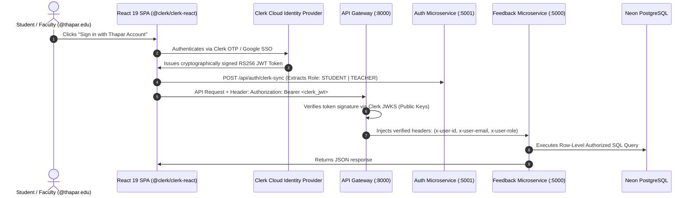

# Third-Party Authentication (Clerk) & Gateway Authorization Architecture

This document describes the design and implementation of the **3rd-Party Identity Provider (Clerk)** integration and **API Gateway Role-Based Authorization (AuthZ)** in the Campus Feedback System.

---

## 🏛️ 1. Architecture & Protocol Sequence

---

## 🔒 2. Key Security Properties

### A. Strict Domain Restriction
- Only authenticated accounts with the `@thapar.edu` email suffix are permitted to access the application.
- If a non-university email is authenticated via Google OAuth, the client-side domain guard immediately terminates the session and returns an **Access Denied** alert.

### B. Stateless JWT Verification
- The API Gateway uses `@clerk/backend` and public JSON Web Key Sets (JWKS) to verify token signatures statelessly without hitting the database on every read request.

### C. Row-Level Database Security (DBMS)
1. **Self-Voting Prevention**: Students cannot vote on their own reviews (`review.reviewerId !== currentUserId`).
2. **Course Offering Ownership**: Faculty can only update or delete courses that match their own `teacherId`.
3. **Transparent Attribution**: Every review permanently records the student's verified roll number and batch for academic accountability.
